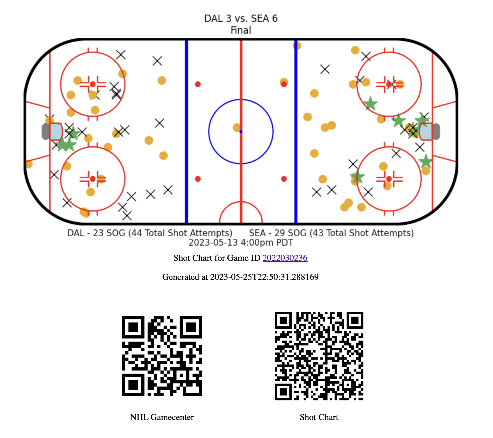
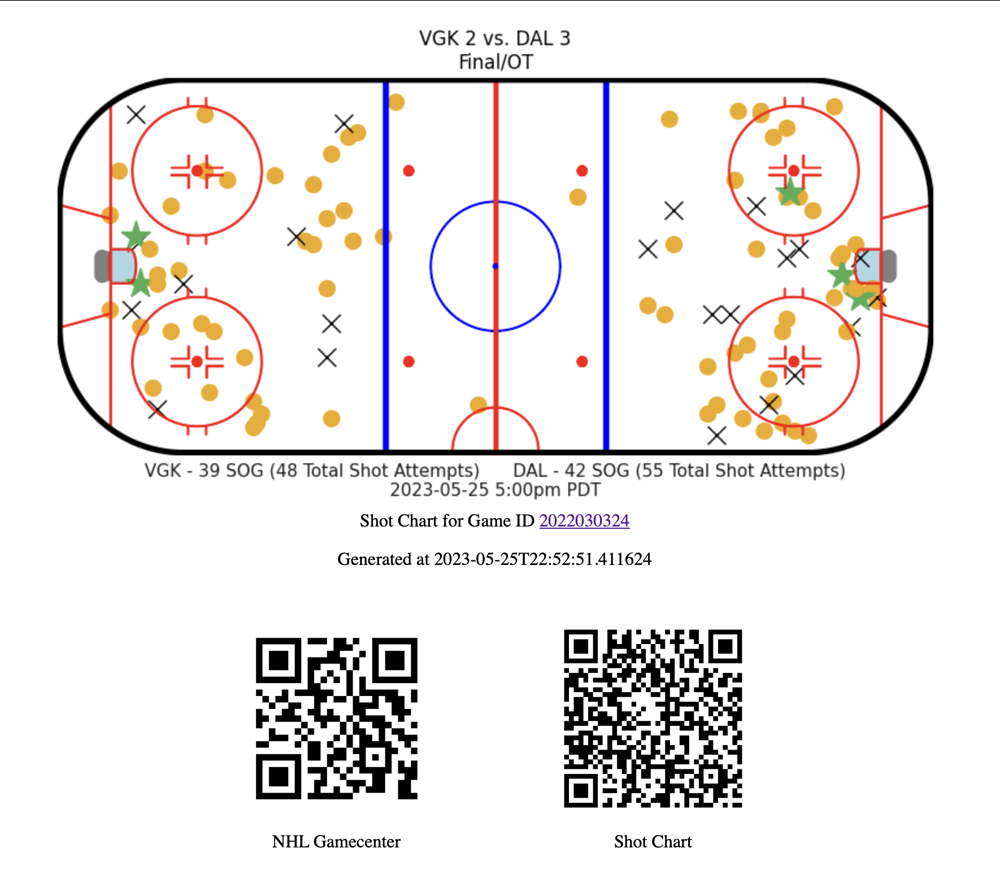

# Welcome
This project will explore creating and deploying a FastAPI project to Vercel.

You can view the [demo](https://nhl-shot-chart-on-vercel-with-fastapi.vercel.app/) on Vercel at [https://nhl-shot-chart-on-vercel-with-fastapi.vercel.app/](https://nhl-shot-chart-on-vercel-with-fastapi.vercel.app/)



If you know the NHL game ID you would like to generate a shot chart for, you can add the `?gameId=XXXXXXXXXX` parameter to the URL. 

For example, clicking on Gamecenter in the NHL scoreboard would take you to a URL that looks something like `https://www.nhl.com/gamecenter/vgk-vs-dal/2023/05/25/2022030324#game=2022030324,game_state=final1`

In this example URL, the `gameId` would be `2022030324`

If you go to the URL [https://nhl-shot-chart-on-vercel-with-fastapi.vercel.app/?gameId=2022030324](https://nhl-shot-chart-on-vercel-with-fastapi.vercel.app/?gameId=2022030324) you will see the shot chart and QR code that links to this particular game:



## Local development

### Install dependencies and run our project

```sh
# Verify that you have Python installed on your machine
% python3 --version

# Create a new virtual environment for the project
% python3 -m venv .venv

# Select your new environment by using the Python: Select Interpreter command in VS Code
#   - Enter the path: ./.venv/bin/python

# Activate your virtual environment
# % source /Users/rob/repos/explore-python-api-development/flask/.venv/bin/activate
% source .venv/bin/activate
(.venv) %

# PREFERRED: Install the packages from requirements.txt
(.venv) % pip install -r requirements.txt

# Install Python packages in a virtual environment
(.venv) % pip install fastapi
(.venv) % pip install uvicorn

# Install QR code packages
(.venv) % pip install qrcode

# Install NHL shot chart visualization packages
(.venv) % pip install arrow
(.venv) % pip install matplotlib
(.venv) % pip install requests
(.venv) % pip install hockey-rink

# When you are ready to generate a requirements.txt file
(.venv) % pip freeze > requirements.txt

# Uninstall the package from your virtual environment
# (.venv) % pip uninstall simplejson

# Remove the dependency from requirements.txt if it exists
# (.venv) % pip uninstall -r requirements.txt

# Let's start our FastAPI server - Available at http://127.0.0.1:8000/
(.venv) % uvicorn main:app --reload
```
