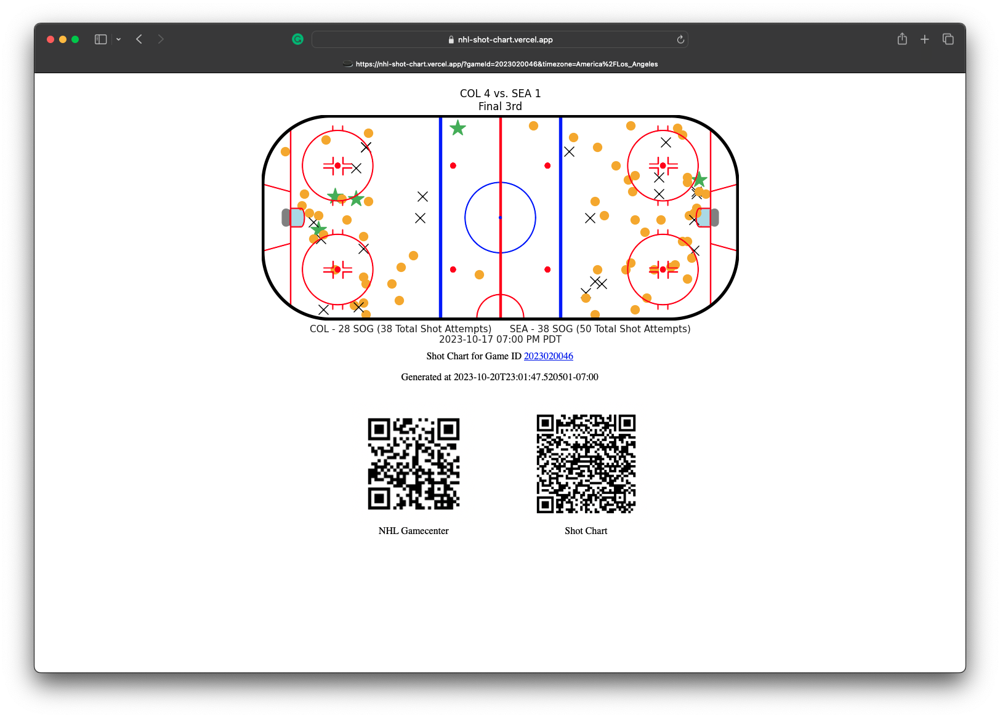

# Welcome

This project generates a shot chart using game data provided by the NHL.


You can view the [demo](https://nhl-shot-chart.vercel.app/) on Vercel at [https://nhl-shot-chart.vercel.app/](https://nhl-shot-chart.vercel.app/)



Example URLs:
- 2023.10.17 - Colorado Avalanche vs. Seattle Kraken 
  - [https://nhl-shot-chart.vercel.app/?gameId=2023020046&timezone=America/Los_Angeles](https://nhl-shot-chart.vercel.app/?gameId=2023020046&timezone=America/Los_Angeles)

## Local development

### Install dependencies and run our project

```sh
# Verify that you have Python installed on your machine
% python3 --version

# Create a new virtual environment for the project
% python3 -m venv .venv

# Select your new environment by using the Python: Select Interpreter command in VS Code
#   - Enter the path: ./.venv/bin/python

# Activate your virtual environment
# % source /Users/rob/repos/explore-python-api-development/flask/.venv/bin/activate
% source .venv/bin/activate
(.venv) %

# Install the packages from requirements.txt
(.venv) % pip install -r requirements.txt

# When you are ready to generate a requirements.txt file
(.venv) % pip freeze > requirements.txt

# Let's start our FastAPI server - Available at http://127.0.0.1:8000/
(.venv) % uvicorn main:app --reload

# To run unit tests:
(.venv) % pytest

# To run unit tests and automatically view the HTML coverage report on macOS:
(.venv) % pytest --cov=. --cov-report=html && open htmlcov/index.html

# To run a single unit test
(.venv) % pytest lib/nhl/test_parse_game_details.py

```
